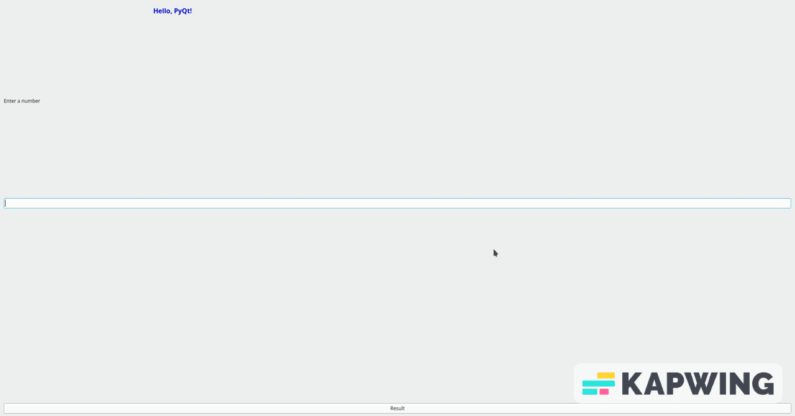

# Bin2Dec App

This is a simple application realized to convert a binary string in its correspondent decimal value.
This is a completely fronted app, since the backend was not needed, and for the UI has been used [PyQt](https://doc.qt.io/qtforpython-6/)
Here's an example of how the software works:
